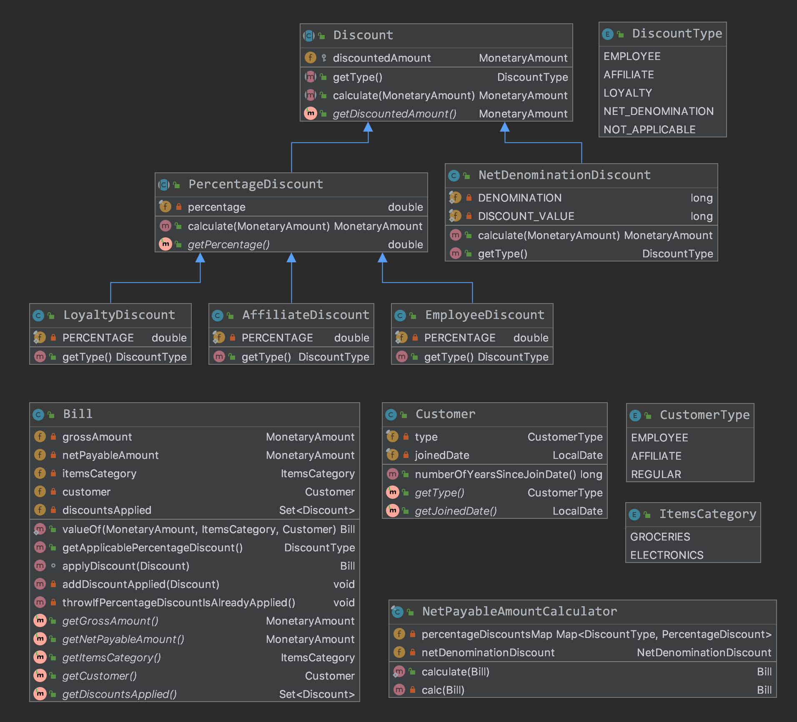

#### Class Diagram

#### Test Snippets

##### Employee Discount

    @Test
    public void givenAmount1000_whenCalculate_shouldReturnDiscountedValue700() {
        PercentageDiscount employeeDiscount = new EmployeeDiscount();
        MonetaryAmount netAmount = employeeDiscount.calculate(Money.of(BigDecimal.valueOf(1000), "USD"));

        assertThat(MoneyUtils.getBigDecimal(netAmount.getNumber())).isEqualTo(BigDecimal.valueOf(700));
        assertThat(employeeDiscount.getDiscountedAmount()).isEqualTo(Money.of(BigDecimal.valueOf(300), "USD"));
    }

##### Net Payable Calculator Test

    @Test
    public void givenBillApplicableForPercentageDiscount_whenCalculate_shouldReturnBillWithNetPayableAmount() {
        Bill bill = NetPayableAmountCalculator
                .calculate(Bill.valueOf(AMOUNT, ItemsCategory.ELECTRONICS, new Customer(CustomerType.EMPLOYEE, NOW)));

        // employee discount and net denomination discount was applied
        assertThat(bill.getNetPayableAmount()).isEqualTo(Money.of(BigDecimal.valueOf(665), "USD"));
    }
    
##### Bill Test
    @Test(expected = DomainViolationException.class)
    public void givenMultiplePercentageDiscount_whenApplyDiscountOnBill_shouldThrowError() {
        Bill bill = Bill.valueOf(AMOUNT, ItemsCategory.ELECTRONICS, new Customer(CustomerType.EMPLOYEE, NOW));
        Discount employeeDiscount = new EmployeeDiscount();
        Discount affiliateDiscount = new AffiliateDiscount();

        bill.applyDiscount(employeeDiscount);
        bill.applyDiscount(affiliateDiscount);
    }