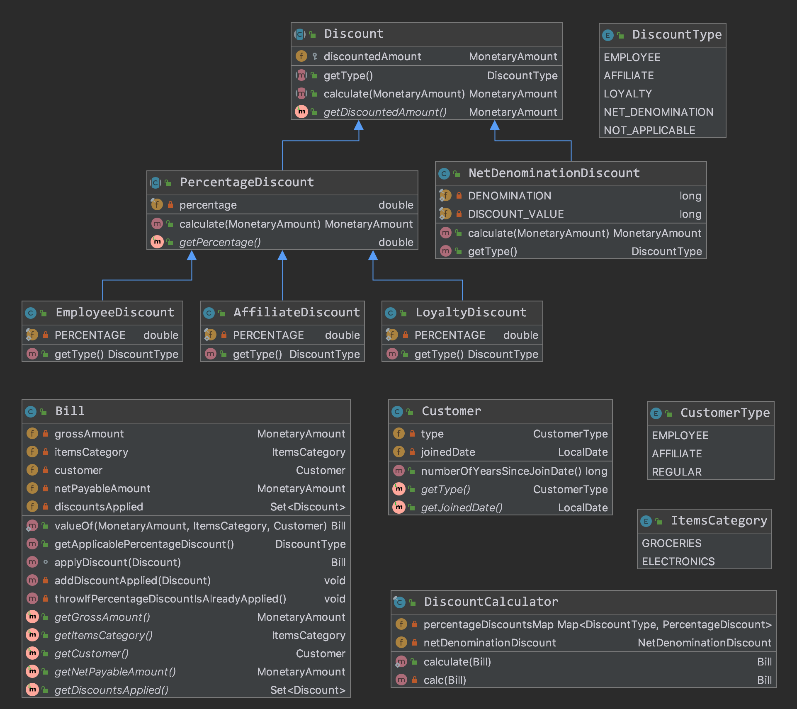

#### Key Implementation Details
[Java Money and Currency API](https://javamoney.github.io/) was used to apply amount calculations. 
Type [MonetaryAmount](http://javadox.com/javax.money/money-api/1.0/javax/money/MonetaryAmount.html) was used to represent an amount.

    @Getter
    public class Bill {
        private MonetaryAmount grossAmount;
        private ItemsCategory itemsCategory;
        private Customer customer;
        private MonetaryAmount netPayableAmount;
        private Set<Discount> discountsApplied;

#### Class Diagram

#### Test Snippets

##### Employee Discount

    @Test
    public void givenAmount1000_whenCalculate_shouldReturnDiscountedValue700() {
        PercentageDiscount employeeDiscount = new EmployeeDiscount();
        MonetaryAmount netAmount = employeeDiscount.calculate(Money.of(BigDecimal.valueOf(1000), "USD"));

        assertThat(MoneyUtils.getBigDecimal(netAmount.getNumber())).isEqualTo(BigDecimal.valueOf(700));
        assertThat(employeeDiscount.getDiscountedAmount()).isEqualTo(Money.of(BigDecimal.valueOf(300), "USD"));
    }

##### Net Payable Calculator Test

    @Test
    public void givenBillApplicableForPercentageDiscount_whenCalculate_shouldReturnBillWithNetPayableAmount() {
        Bill bill = NetPayableAmountCalculator
                .calculate(Bill.valueOf(AMOUNT, ItemsCategory.ELECTRONICS, new Customer(CustomerType.EMPLOYEE, NOW)));

        // employee discount and net denomination discount was applied
        assertThat(bill.getNetPayableAmount()).isEqualTo(Money.of(BigDecimal.valueOf(665), "USD"));
    }
    
##### Bill Test
    @Test(expected = DomainViolationException.class)
    public void givenMultiplePercentageDiscount_whenApplyDiscountOnBill_shouldThrowError() {
        Bill bill = Bill.valueOf(AMOUNT, ItemsCategory.ELECTRONICS, new Customer(CustomerType.EMPLOYEE, NOW));
        Discount employeeDiscount = new EmployeeDiscount();
        Discount affiliateDiscount = new AffiliateDiscount();

        bill.applyDiscount(employeeDiscount);
        bill.applyDiscount(affiliateDiscount);
    }

##### Controller Test
    @Test
    public void givenValidRequest_whenPost_shouldReturnDiscountedBill() throws Exception {

        BillDto billDto = new BillDto();
        billDto.setGrossAmount(new AmountDto(BigDecimal.valueOf(1000), "USD"));
        billDto.setCustomer(new CustomerDto("EMPLOYEE", LocalDate.of(2018, 01, 01)));
        billDto.setItemsCategory("ELECTRONICS");

        MvcResult mvcResult = this.mockMvc.perform(
                post("/bills/calculate-discount")
                        .contentType(MediaType.APPLICATION_JSON)
                        .content(GSON.toJson(billDto)))
                .andExpect(status().isOk())
                .andDo(document("calculate-discount", preprocessRequest(prettyPrint()), preprocessResponse(prettyPrint()),
                        CalculateDiscountApiDocs.apiRequestFields(),
                        CalculateDiscountApiDocs.apiResponseFields()
                )).andReturn();

        DiscountedBillDto discountedBillDto = GSON.fromJson(mvcResult.getResponse().getContentAsString(), DiscountedBillDto.class);
        assertThat(discountedBillDto.getGrossAmount()).isEqualTo(billDto.getGrossAmount());
        assertThat(discountedBillDto.getNetPayableAmount()).isEqualTo(new AmountDto(BigDecimal.valueOf(665), "USD"));
        assertThat(discountedBillDto.getAppliedDiscounts()).hasSize(2);
        assertThat(discountedBillDto.getAppliedDiscounts())
                .containsAnyOf(
                        new DiscountDto("NET_DENOMINATION", new AmountDto(BigDecimal.valueOf(35), "USD")),
                        new DiscountDto("EMPLOYEE", new AmountDto(BigDecimal.valueOf(300), "USD"))
                );

    }